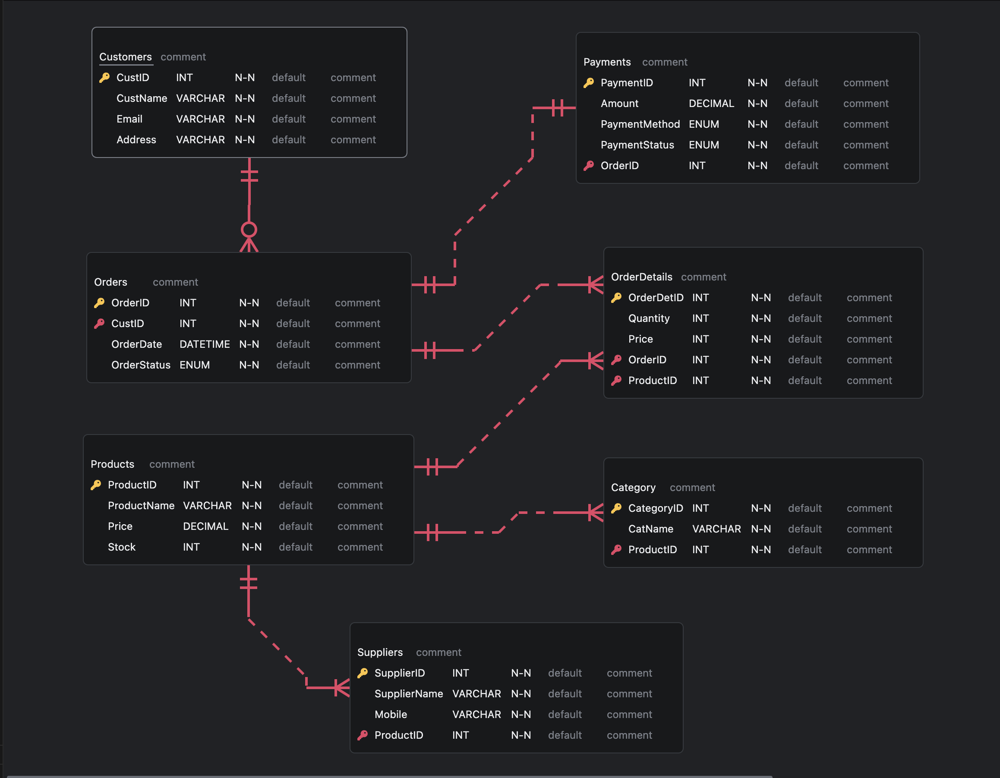

# eCommerce SQL Project

This project is focused on designing and querying an eCommerce database using MySQL. It includes schema design, data normalization, and ETL (Extract, Transform, Load) operations using Python.

## 📁 Project Structure

- `eCommerce.sql` - Contains the SQL code for creating tables, inserting sample data, and writing queries.
- `ecom.vuerd.json` - A visual schema design file generated using Vuerd.
- `eComm_etlpipeline.py` - A Python script that connects to the database and performs basic ETL operations using SQLAlchemy.

## 🔧 Technologies Used

- MySQL
- Python 3.x
- SQLAlchemy
- VSCode
- Vuerd (for visual database design)

## 💡 Features

- Normalized relational schema design
- Data ingestion through ETL pipeline
- SQL queries for key business insights

## 🧬 Database Schema

Here’s a visual representation of the eCommerce database schema:

## 🧪 Sample Queries

The project includes queries for:
- Customer purchase behavior
- Product performance
- Revenue by category
- Inventory tracking

# SnackSmart
